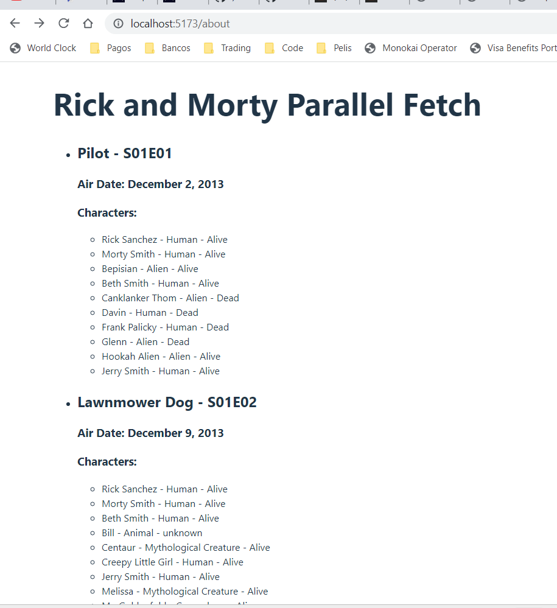

# Make It Real - Peticiones en paralelo

## This is a solution to the _peticiones en paralelo_ mission of the Make It Real course.

## The challenge

create a React Project

## Vercel page

https://peticiones-en-paralelo-theta.vercel.app/

## Screenshot

## My process

### Built with

- Semantic markup using vscode editor
- React code using vite in vs code
- useEffect

## What I learned

I practice and learn how to fetch information from an API with parallel fetch

## Author

Juan David Peña
github - @juandape
email - juandavidp76@hotmail.com

## Acknowledgments

Thanks to Make it Real to show me a path to become a better programmer
